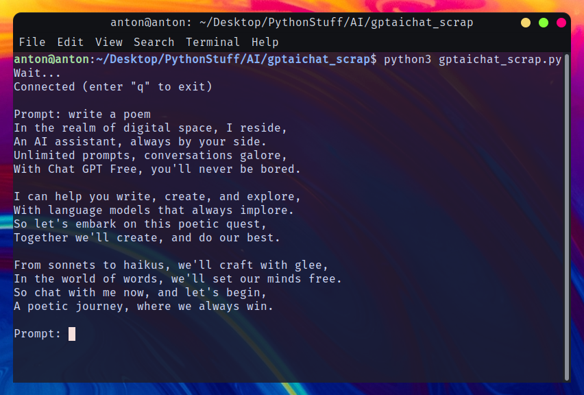

# gptaichat_scrap

This project is about a python program which uses selenium to scrap the answers from the site i.e. gptaichat.org making it as a command line/terminal chat bot.


## Note

Scraping a site is against the policies. This program is just for the personal project stuff.


## Installation

To install this, first clone this repository and install the required libraries.

```bash
git clone https://github.com/NightHunt04/gptaichat_scrap.git
cd gptaichat_scrap
pip install -r requirements.txt
```

To run the program, make sure you are in the gptaichat_scrap directory, then simply run the program.
(python3 for linux)

```bash
python3 gptaichat_scrap.py
```

# Outcome



